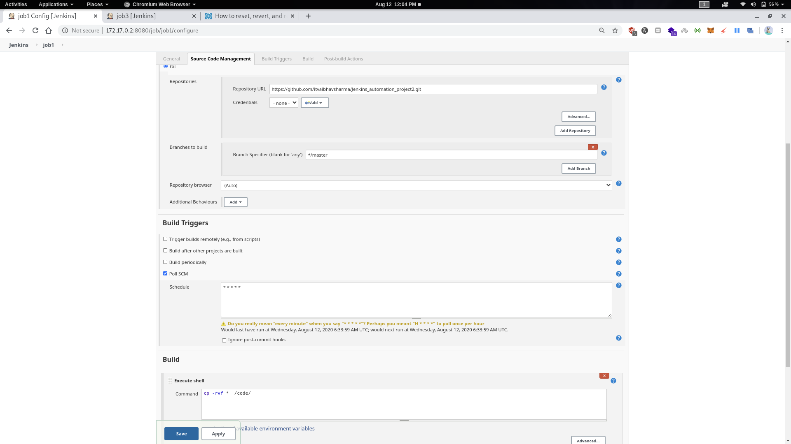
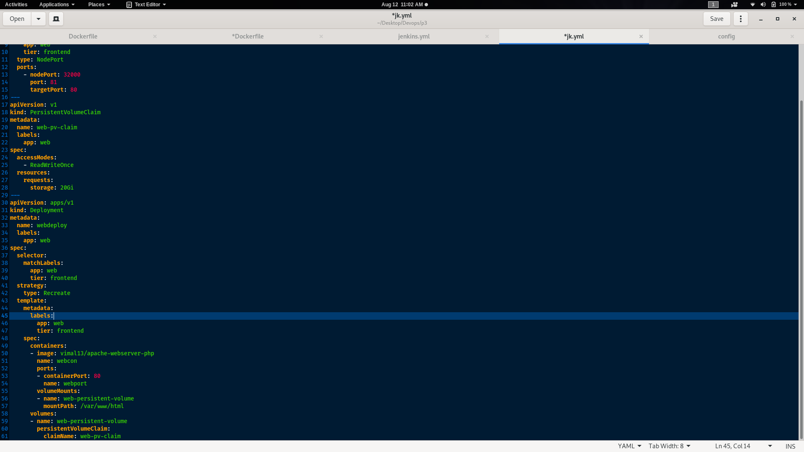
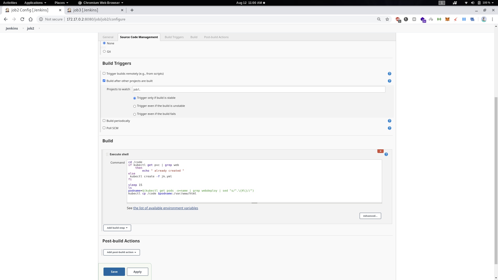
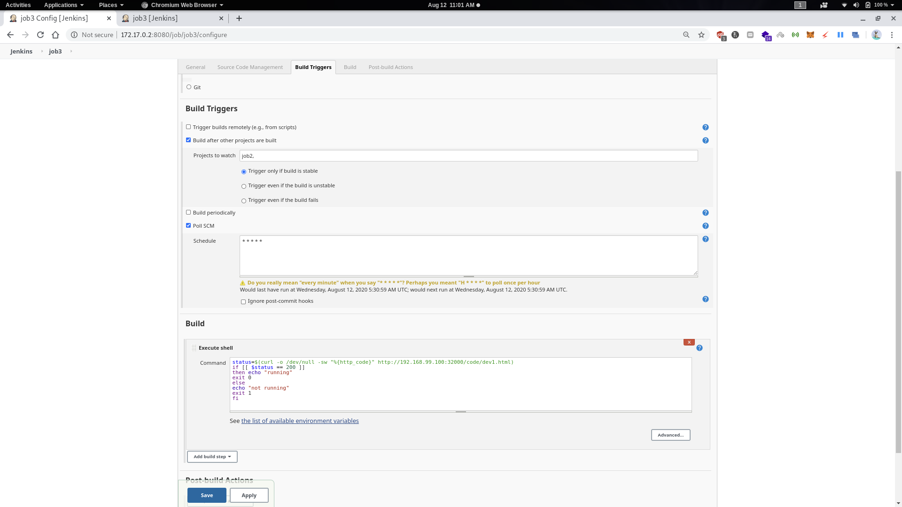
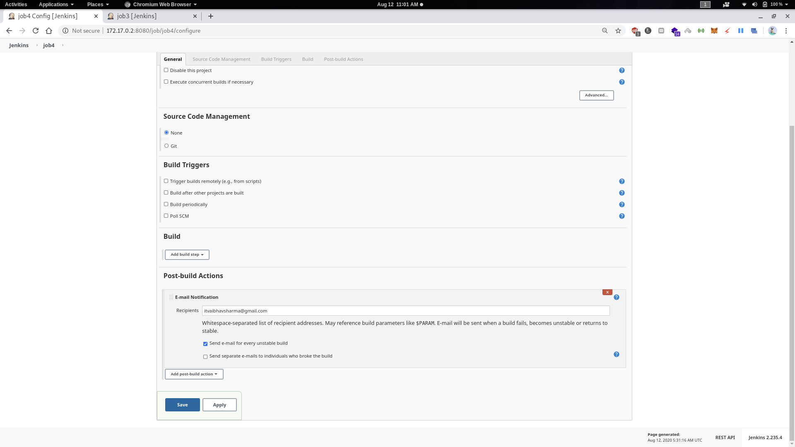
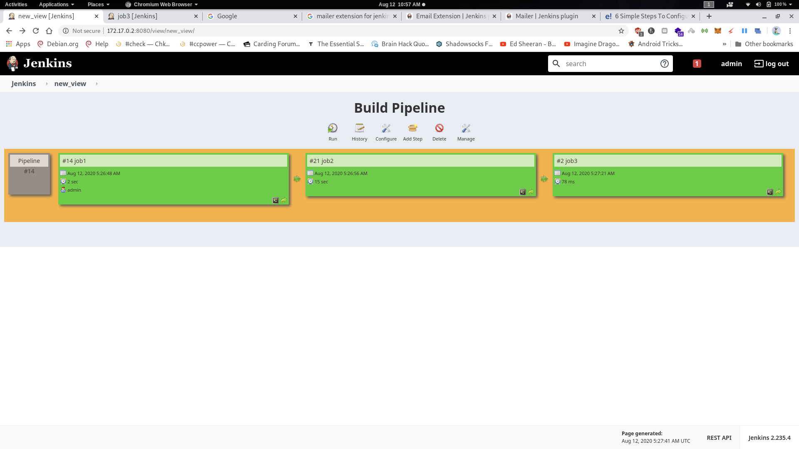
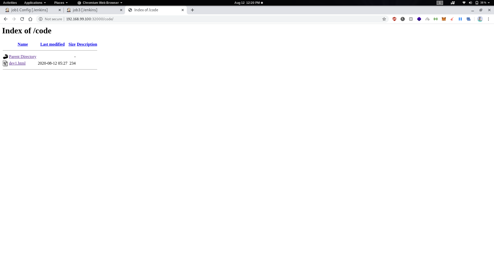

# Jenkins_Automation_project3

Create container image that’s has Jenkins installed  using dockerfile  Or You can use the Jenkins Server on RHEL 8/7
When we launch this image, it should automatically starts Jenkins service in the container.
Create a job chain of job1, job2, job3 and  job4 using build pipeline plugin in Jenkins 

***Intitial Setup***
**Setting Up Docker File**
used to set up K8S in Jenkins docker image
*for this we need files from kubes server
-ca.crt
-client.crt
-client.key
-config*

**Editing config file** *editing file according to your system*

Use the docker file to make docker image

docker build -t cos:v3 .

docker run -it --name jenkins cos:v3

**Job1 :** 

**Job2 :**
  By looking at the code or program file, Jenkins should automatically start the respective language interpreter installed image container to deploy code on top of   Kubernetes ( eg. If code is of  PHP,then Jenkins should start the container that has PHP already installed )
  Expose your pod so that testing team could perform the testing on the pod
  Make the data to remain persistent ( If server collects some data like logs, other user information )

Here we use jk.yml to deploy k8s cluster

jk.yml

**Job3 :** 
  Test your app if it  is working or not.
  
  
 
**Job4 :**
  if app is not working , then send email to developer with error messages and redeploy the application after code is being edited by the developer.
  
  we use emailer to do this
  
  
  
  **View in Build Pipeline**
  
  
  ***Result***
  
  
  
 
